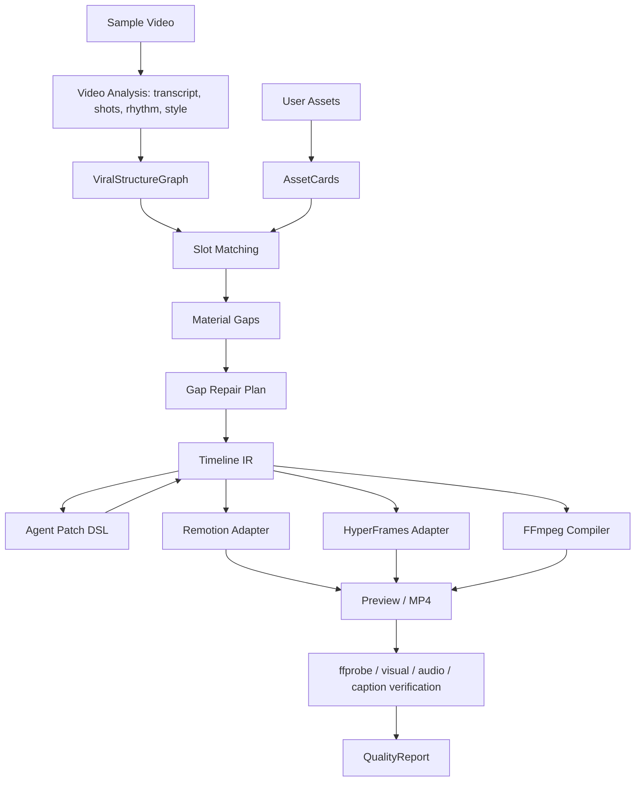

# Video Editing Framework Research for Viral Struct AI

Date: 2026-06-05

## Bottom Line

For this project, the right decision is not a single winner between HyperFrames and Remotion.

Use a layered architecture:

1. `ViralStructureGraph -> Timeline IR` as the product source of truth.
2. An Agent-safe patch DSL for local edits, gap repair, and timeline changes.
3. FFmpeg/ffprobe as the media primitive and verification layer.
4. Remotion as the mature React/TypeScript preview/render adapter.
5. HyperFrames as an Agent-native HTML/CSS render adapter for visual packaging, captions, product cards, transitions, and deterministic experiments.
6. OpenTimelineIO as a timeline design reference and possible interchange/export format, not as the primary renderer.

If we must choose one first for the current codebase, choose **Remotion first as the production adapter**, because the repo already has `packages/remotion-video`, the backend is TypeScript, and Remotion has mature Player/renderer/Lambda APIs. But for the longer-term "video editing Agent" direction, keep **HyperFrames as a serious spike**, because its HTML-as-timeline and JSON/lint/render loop is more naturally Agent-readable.

## Project-Specific Reading

The GOAL.pdf is asking for a "viral structure migration engine", not a generic editor:

- Analyze sample video structure: script, shot rhythm, captions, packaging, transitions, BGM beats.
- Transfer structure to a new product/topic/user materials.
- Detect missing material slots and repair them.
- Output script/storyboard/timeline/packaging/render.
- Show a verifiable process and support human adjustment / natural-language edits.

The existing codebase already has the right conceptual pieces:

- `ViralStructureGraph`
- `AssetCard`
- `SlotMatch`
- `MaterialGap`
- `GapRepair`
- `TimelineItem`
- `QualityReport`

Therefore the renderer must not become the product brain. The product brain is the structure migration and timeline protocol.

## Recommended Architecture



The Agent should operate `Timeline IR` and patch commands, for example:

```json
{
  "op": "replace_slot_asset",
  "slotId": "hook_visual_001",
  "assetId": "asset_product_closeup_003",
  "reason": "The sample hook uses an immediate product closeup; the current asset is too wide."
}
```

It should not freely generate raw FFmpeg filtergraphs, raw React files, or random HTML for the primary product path.

## Remotion

Recommended role: **primary renderer / preview adapter for MVP**.

Why it fits:

- Official docs position Remotion around programmatic React video, Player, server-side rendering, Lambda, captions, and AI workflows. Sources: [Remotion docs](https://www.remotion.dev/docs/), [Player](https://www.remotion.dev/docs/player), [renderMedia](https://www.remotion.dev/docs/renderer/render-media), [Lambda](https://www.remotion.dev/docs/lambda), [AI docs](https://www.remotion.dev/docs/ai).
- It maps cleanly to the current TypeScript monorepo.
- `TimelineItem.start/end` can become frame ranges.
- Captions, cards, stickers, product callouts, and packaging templates can become React components.
- The Player can later support the redesigned UI without forcing the backend to wait for UI.

Risks:

- Remotion is not the structure migration Agent. It is a renderer.
- If the Agent patches React directly, edits become hard to validate.
- Remotion's official timeline UI component is paid.
- License matters: Remotion is free for individuals, non-profits, and for-profit organizations with up to 3 employees; otherwise a company license is required. Source: [Remotion License & Pricing](https://www.remotion.dev/docs/license).

Best use here:

`Timeline IR -> Remotion composition -> Player preview -> @remotion/renderer MP4`.

## HyperFrames

Recommended role: **secondary renderer / Agent-native visual packaging adapter**.

Why it fits:

- HyperFrames renders HTML into deterministic MP4 and treats HTML as the timeline. Sources: [HyperFrames docs](https://hyperframes.video/docs), [Introduction](https://hyperframes.video/docs/getting-started/introduction).
- It is explicitly designed for agents: non-interactive CLI, `--json`, lint/render loop, stable exits, self-correction. Source: [For AI agents](https://hyperframes.video/docs/recipes/ai-agents).
- It is strong for product cards, subtitles, stickers, transitions, animated packaging, GSAP/Lottie/Three/CSS style work.
- Render docs emphasize hash-stable output, frame manifests, workers, codec presets, and reproducible outputs. Source: [HyperFrames Render](https://hyperframes.video/docs/workflow/render).

Risks:

- It is not a full NLE and official docs say it is not a timeline editor/NLE.
- It is newer and v0.x; lock versions and render-test outputs.
- Beat detection, shot boundary analysis, material matching, and gap repair remain upstream responsibilities.
- Production should use fixed Docker/render images, otherwise fonts/Chrome/local environment can weaken determinism.

Best use here:

`Timeline IR -> HyperFrames HTML/CSS project -> lint --json -> render --json -> MP4/hash/manifest`.

## FFmpeg / ffprobe

Recommended role: **media primitive and verification foundation**.

Why it is required:

- FFmpeg is the universal media converter and filter/transcode/mux/demux tool; ffprobe gives machine-readable media inspection. Sources: [FFmpeg docs](https://ffmpeg.org/ffmpeg.html), [FFmpeg filters](https://ffmpeg.org/ffmpeg-filters.html).
- It handles trimming, concatenation, crop, resize, subtitles, audio mixing, loudness, thumbnails, transcode, black/freeze/silence detection, and metadata.
- Existing code already uses ffprobe/ffmpeg-static, so this is not foreign to the repo.

Risk:

- Raw FFmpeg is too sharp for an LLM to freely write. Wrap it behind validated operations and compile from a safe DSL.

Best use here:

`Timeline IR -> validated media operations -> FFmpeg commands -> ffprobe verification`.

## OpenTimelineIO

Recommended role: **timeline schema reference / interchange format**.

Why it helps:

- OTIO represents editorial timeline data with timelines, tracks, stacks, clips, gaps, transitions, markers, metadata, and media references. Sources: [OpenTimelineIO timeline structure](https://opentimelineio.readthedocs.io/en/latest/tutorials/otio-timeline-structure.html), [GitHub](https://github.com/AcademySoftwareFoundation/OpenTimelineIO).
- It is useful for thinking clearly about tracks, gaps, transitions, nested compositions, and export/import.

Risk:

- OTIO is not a renderer and does not define all visual effects behavior.
- It should inform the internal DSL, not replace the product's own structure migration types.

Best use here:

`Timeline IR <-> OTIO export`, especially for debugging, interoperability, or future NLE export.

## MoviePy, MLT, editly, WebCodecs

MoviePy:

- Good for Python prototypes and simple programmatic editing.
- Not ideal as the production renderer for this TypeScript backend because it is slower and Python-centered. Source: [MoviePy docs](https://zulko.github.io/moviepy/).

MLT:

- Mature multitrack NLE framework, useful as a deep reference or future complex renderer.
- Too heavy as the first backend path. Source: [MLT docs](https://www.mltframework.org/docs/).

editly:

- Great reference for an Agent-readable JSON/JS video spec with clips, layers, transitions, and audio tracks.
- Not flexible enough to become the core engine. Source: [editly GitHub](https://github.com/mifi/editly).

WebCodecs / ffmpeg.wasm:

- Useful later for browser-side preview or local client-side operations.
- Not the production backend renderer. WebCodecs does not include muxing/demuxing by itself. Sources: [MDN WebCodecs](https://developer.mozilla.org/en-US/docs/Web/API/WebCodecs_API), [ffmpeg.wasm](https://github.com/ffmpegwasm/ffmpeg.wasm).

## What A Video Editing Agent Needs

Core data:

- Project state as the single source of truth.
- Sample structure graph.
- Asset inventory with metadata, embeddings, transcript, keyframes, rights/source info.
- Timeline IR with tracks, clips, subtitles, cards, transitions, audio, repair annotations.
- Render manifest and quality report.

Core tools:

- `analyze_sample_video`
- `extract_structure_graph`
- `analyze_asset_library`
- `match_slots`
- `detect_material_gaps`
- `plan_gap_repairs`
- `generate_timeline`
- `patch_timeline`
- `render_preview`
- `render_final`
- `verify_render`

Guardrails:

- JSON schema validation for every Agent output.
- Patch-based edits instead of whole-file rewrites.
- Deterministic fixture mode for demos, explicitly marked.
- Media preflight: duration, fps, dimensions, codec, audio streams, corrupt files, CORS/range support if remote.
- Render verification: output duration, black/freeze/silence checks, subtitle existence, audio loudness, thumbnail/contact sheet, keyframe diff.
- Cost and provider logs for AIGC inserts, voiceover, ASR, VLM, and render jobs.

## Open-Source Projects Worth Reading

Highest-priority architecture references:

1. [video-use](https://github.com/browser-use/video-use) - video becomes Agent-readable structured context, then EDL/render/self-eval.
2. [Montaj](https://github.com/theSamPadilla/montaj) - project state, workflow/skill split, CLI-first Agent workflow.
3. [Framedeck](https://github.com/kevinrss01/framedeck) - natural-language timeline edits, validated editor actions, Remotion-based render path.
4. [mcp-video](https://kyanitelabs.github.io/mcp-video/) - many FFmpeg/Remotion operations exposed as Agent tools with structured JSON outputs.
5. [OpenMontage](https://github.com/calesthio/OpenMontage) - broader agentic video production pipeline, useful for provider orchestration and review loops.
6. [editly](https://github.com/mifi/editly) - useful DSL inspiration for clips/layers/audio tracks.
7. [auto-editor](https://github.com/WyattBlue/auto-editor) - useful for silence/motion-based automatic cuts and NLE export ideas.

Read-only / caution:

- [Vex](https://github.com/AKMessi/vex) appears architecturally interesting, but if it is source-available non-commercial, treat it as inspiration only, not a dependency.

## Recommendation

Do this next:

1. Define `Timeline IR v1` in `packages/shared`, stricter than today's `TimelineItem[]`.
2. Define `TimelinePatch` operations for natural-language edit output.
3. Build a Remotion adapter that consumes `Timeline IR v1`, replacing the hardcoded demo.
4. Build an FFmpeg preflight/verifier service and render manifest.
5. Spike HyperFrames with the exact same `Timeline IR v1` on a 10-20 second vertical sample.
6. Compare Remotion vs HyperFrames on:
   - Agent patch success rate
   - visual packaging quality
   - subtitle/style migration quality
   - render determinism
   - deployment friction
   - license/commercial risk

The likely final product shape is:

`Structure Migration Agent + Timeline DSL + FFmpeg verification + Remotion default renderer + HyperFrames packaging/Agent renderer`.
